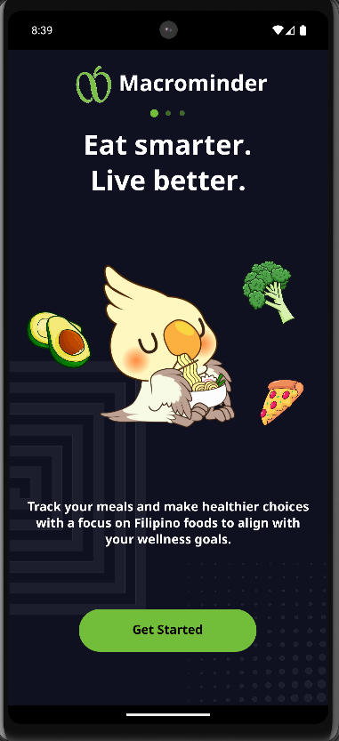
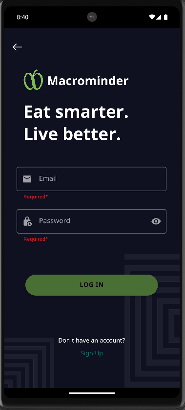
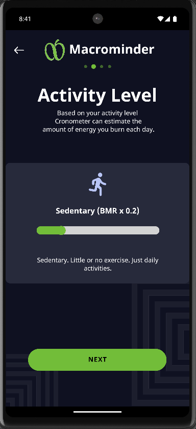
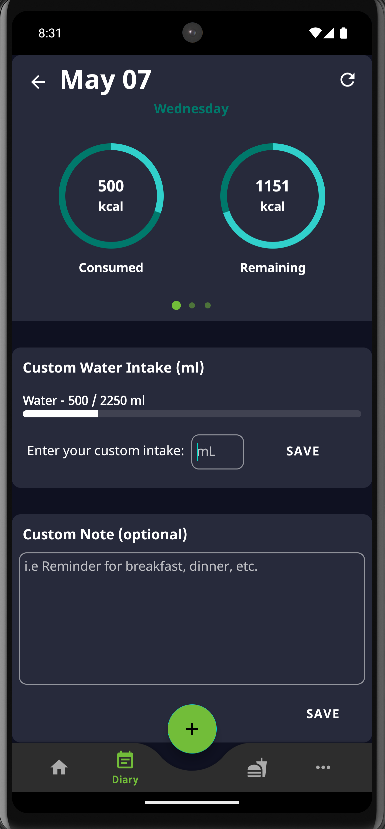
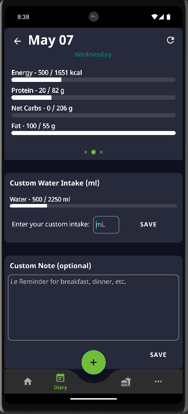
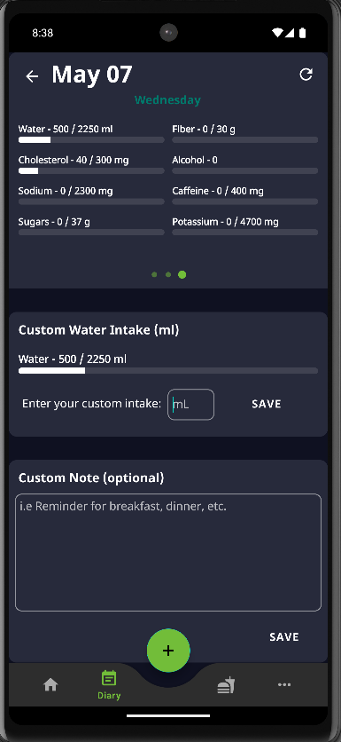

# Macrominder - Macronutrients tracker Android App!

A native Android app built with Kotlin and XML created by Art Lyndone Hemplo.

## Features
- Firebase Firestore integration
- Firebase Authentication
- Step-by-Step profile creation entering personal details such as Gender, Birthdate, Height, Weight, Activity Level, and Fitness Goals. (Data is used to generate personalized nutritional recommendations for the user)
- USDA gov API integration
- A slide that includes a diary where users can track their own progress, monitor each and every nutrient available.
- Unit Converter

## How to Run
1. Clone the repo
2. Open in Android Studio
3. Add your `google-services.json` to the `app/` folder for your own Firebase API key
4. Add your own USDA gov api key in RetrofitInstance.kt
5. Build and run

## 3 Onboarding Screen slides

## Login

## Signup

## Macros Tracked

